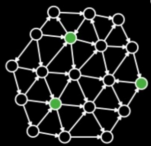
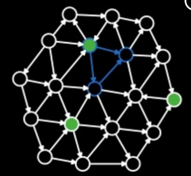
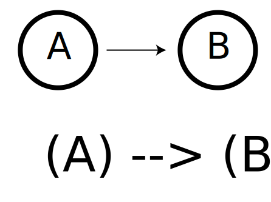
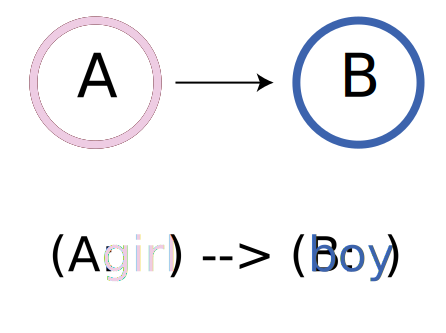
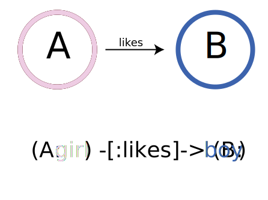
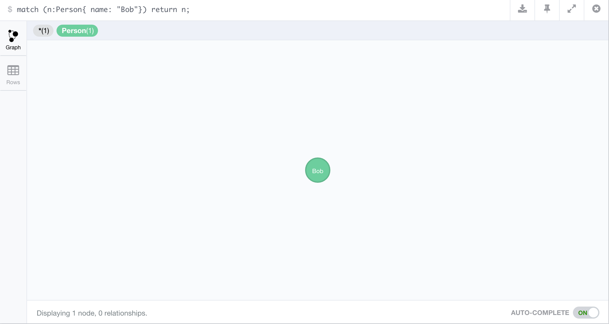

<style>
.sessionInfo code{
  font-size: 60%;
   }

pre {
 white-space: pre-wrap;       /* css-3 */
 white-space: -moz-pre-wrap;  /* Mozilla, since 1999 */
 white-space: -pre-wrap;      /* Opera 4-6 */
 white-space: -o-pre-wrap;    /* Opera 7 */
 word-wrap: break-word;       /* Internet Explorer 5.5+ */
 text-align: left
}

article div h3{
 text-align: left
}

.title-slide {
    background-color: #FFF
}

img {
  max-height: 560px;
  max-width: 964px;
}
</style>

## Background

* Neo4j is a noSQL database which models its data as a graph
* latest version is 2.3.1

---
## Outline

1. Using RNeo4j to connect with a hosted graphDB via Neo4j's REST API
2. Executing cypher queries
3. Using `IGRAPH` to plot and visualise data locally.
4. Using `SHINY` and a `HTMLTOOLS` package `SIGMA` to interactively visualise graph data in a dashboard

--- &twocol

## What is a graph

```{r echo=FALSE}
suppressPackageStartupMessages(library(igraph))
suppressPackageStartupMessages(library(visNetwork))
suppressPackageStartupMessages(library(dplyr))
suppressPackageStartupMessages(library(magrittr))
```

*** =left

```{r createRandomGraph,cache=FALSE, echo=FALSE}
set.seed(1000)
g = erdos.renyi.game(100, 1/100, directed=TRUE)
V(g)$name = 1:vcount(g)
plot(g, vertex.label="", vertex.size=3, edge.arrow.size=0.5)
```

*** =right

* __Lines__ are edges
* __Circles__ are nodes / vertices

---

## Why NEO4J - Pattern Search


--- &twocol

## Why use NEO4J

* Pattern Search

*** =left

*** =right


--- &twocol

## Why NEO4J?

### CYPHER allows for path based queries

*** =left



*** =right

* CYPHER allows for an ASCII representation of a path

--- &twocol

## NODE LABELS

*** =left



*** =right

* Finds nodes which of a certain type
* Find paths constructed by these nodes

--- &twocol

## CYPHER: EDGE LABELS

*** =left



*** =right

* Finds nodes which of a certain type
* Find patterns made up of these nodes

```cypher
MATCH
    (A:girl) -[:likes]-> (B:boy)
RETURN
    A, B
```

--- &twocol

## CYPHER: Path

*** =left


*** =right

* Finds nodes which of a certain type
* Find patterns made up of these nodes

```cypher
MATCH
    (A: girl {name: 'ally'})-[:likes]->(B: boy)
RETURN
    B
```

---

## Using R with Neo4j

```{r eval=FALSE, echo=FALSE}
devtools::install_github("nicolewhite/RNeo4j")
```

```{r warning=FALSE, message=FALSE}
library(RNeo4j)
```

```{r echo=FALSE}
library(digest)
```

## 1. Connect with Neo4j

```{r echo=FALSE, eval=FALSE}
write.aes <- function(df, filename, key) {
  zz <- textConnection("out","w")
  write.csv(df,zz, row.names=F)
  close(zz)
  out <- paste(out,collapse="\n")
  raw <- charToRaw(out)
  raw <- c(raw,as.raw(rep(0,16-length(raw)%%16)))
  aes <- AES(key,mode="ECB")
  aes$encrypt(raw)
  writeBin(aes$encrypt(raw), filename)  
}
key <- as.raw(sample(1:16, 16))
aes <- AES(key, mode="ECB")
save(key,file = "key.RData")
credientials = data.frame(user = username, pass = password, stringAsFactors=F)
write.aes(df = credentials, filename = "credentials.txt", key = key)
```

```{r readCredentials, echo=FALSE}
load("key.RData")

# read encypted data frame from file
read.aes <- function(filename,key) {
  dat <- readBin(filename,"raw",n=1000)
  aes <- AES(key,mode="ECB")
  raw <- aes$decrypt(dat, raw=TRUE)
  txt <- rawToChar(raw[raw>0])
  read.csv(text=txt, stringsAsFactors = F)
}
cred = read.aes("credentials.txt", key = key)
```

```{r connect}
graph <- startGraph("http://metamaps.scelse.nus.edu.sg:7474/db/data/",
            user = cred$user,
            pass = cred$pass)
```

### Security

Set the following if you wish to DISABLE user password login:
`dbms.security.auth_enabled=false` to in `conf/neo4j-server.properties`.


---

## Cypher Functions 101

### Finding a node

```cypher
MATCH (label: {property: })
```


--- &twocol

## 2. Sending A query

*** =left

### Cypher Query

```cypher
MATCH
    (koi:ko {ko:'ko:K00531'})
RETURN
    koi
```

* Search for a node, `koi` 
    * with label `ko`, 
        * property `ko` of value `ko:K00531`

*** =right

### R code

```{r}
nodeOfInterest <-
graph %>% getNodes(
    query = "MATCH  (koi:ko {ko:'ko:K00531'})
             RETURN koi"
    )
```

Node returned by the query is saved as a variable in R.

--- &twocol

## 2a. Cypher Query  - Returning as NODE "object"

*** =left
### Node Attributes

```{r echo=FALSE , results='asis'}
noi = names(attributes(nodeOfInterest[[1]]))
noi = paste0(sprintf("<li>%s</li>", noi), collapse="")
cat(noi)
```

* **Self** stores the ID, thats how the functions deal with this node

*** =right

### Node Data

```{r echo=FALSE}
attributes(nodeOfInterest[[1]]) = NULL
str(nodeOfInterest[[1]])
```

---

## 2b. Cypher Query - Returning as data.frame

If you know the property you're interested in, you could plan the query to return it as a data.frame

```{r}
df = graph %>%
cypher(
"MATCH
    (koi:ko {ko:'ko:K00531'})
RETURN
    koi.ko,
    koi.definition,
    koi.name
    ")
```

```{r echo=FALSE}
df
```

---

## Creating a node

```{r echo=FALSE}
rm(graph)
```

```{r cache=FALSE}
graph2 = startGraph("http://localhost:7474/db/data/")
bob = graph2 %>%
        createNode("Person", 
                   name = "Bob", 
                   age = 24, 
                   kids = c("Jenny", "Larry"))
#attributes(bob)$self
```
<div class="centered">

</div>

---

## Edge creation

```{r cache=FALSE, results="hide"}
alice   = createNode(graph2, "Person", name = "Alice")
#attributes(alice)$self
charles = createNode(graph2, "Person", name = "Charles")
#attributes(charles)$self

createRel(alice, "WORKS_WITH", bob)
createRel(bob, "KNOWS", charles, since = 2000, through = "Work")
createRel(alice, "KNOWS", charles, list(since = 2001, through = "School"))
```

--- &twocol

*** =left

## Visualising in Igraph

Using cypher get the subgraph which you're interested in and return as an edge list.

```{r}
edgelist = graph %>% cypher(
"
UNWIND
    {names} AS namelist
MATCH
    (p:Person {name:namelist}) -- (connection:Person)
RETURN
    p.name,
    connection.name
", list(names = c("Alice", "Bob", "Charles"))
)
edgelist %<>% setNames(c("from", "to"))
edgelist
```

*** =left

Convert to igraph object and plot

```{r}
g = graph_from_data_frame(edgelist)
plot(g, vertex.size=3, edge.arrow.size=0.5)
```
--- &twocol

## Common Network analyses

*** =left


*** =right

### Extraction

* subgraphs
* order
* cliches

--- &twocol

## Common Network analyses

*** =left


*** =right

### Algorithms


* shortest path
* Lowest Common Ancestor
* Centrality
* Betweeness

--- &twocol


---

## Metabolic graph

---

## Example Query

```cypher
UNWIND
    { kos } AS koss
OPTIONAL MATCH
    (ako:ko {ko: koss.ko})<--(cpd:cpd)
RETURN 
    cpd.cpd        AS child,
    ako.ko         AS parent,
    ako.definition AS parentName,
    ako.name       AS parentSym,
    cpd.name       AS childName,
    cpd.name       AS childSym
```

--- .sessionInfo

```{r echo=FALSE}
sessionInfo()
```
