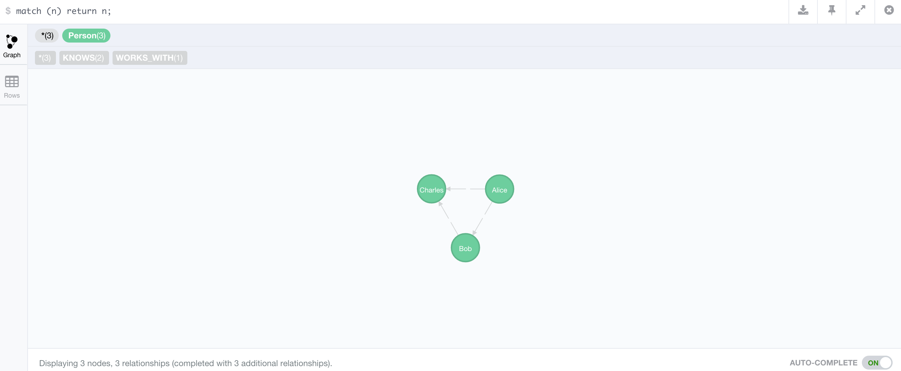

```{r echo=FALSE}
library(digest)
```

```{r echo=FALSE, eval=FALSE}
write.aes <- function(df, filename, key) {
  zz <- textConnection("out","w")
  write.csv(df,zz, row.names=F)
  close(zz)
  out <- paste(out,collapse="\n")
  raw <- charToRaw(out)
  raw <- c(raw,as.raw(rep(0,16-length(raw)%%16)))
  aes <- AES(key,mode="ECB")
  aes$encrypt(raw)
  writeBin(aes$encrypt(raw), filename)  
}
key <- as.raw(sample(1:16, 16))
aes <- AES(key, mode="ECB")
save(key,file = "key.RData")
credientials = data.frame(user = username, pass = password, stringAsFactors=F)
write.aes(df = credentials, filename = "credentials.txt", key = key)
```

<style>
.sessionInfo code{
  font-size: 60%;
}
/* code to wrap properly */
pre {
 white-space: pre-wrap;       /* css-3 */
 white-space: -moz-pre-wrap;  /* Mozilla, since 1999 */
 white-space: -pre-wrap;      /* Opera 4-6 */
 white-space: -o-pre-wrap;    /* Opera 7 */
 word-wrap: break-word;       /* Internet Explorer 5.5+ */
 text-align: left
}

article div h3{
 text-align: left
}

.title-slide {
    background-color: #FFF
}

img {
  max-height: 560px;
  max-width: 964px;
}
</style>

## Background

* Neo4j is a noSQL database which models its data as a graph
* latest version is 2.3.2

---
## Outline

1. Using RNeo4j to connect with a hosted graphDB via Neo4j's REST API
2. Executing cypher queries
3. Using `IGRAPH` to plot and visualise data locally.
4. Using `SHINY` and a `HTMLTOOLS` package `SIGMA` to interactively visualise graph data in a dashboard

--- &twocol

## What is a graph

```{r echo=FALSE}
suppressPackageStartupMessages(library(igraph))
suppressPackageStartupMessages(library(visNetwork))
suppressPackageStartupMessages(library(dplyr))
suppressPackageStartupMessages(library(magrittr))
```

*** =left

```{r createRandomGraph,cache=FALSE, echo=FALSE}
set.seed(1000)
g = erdos.renyi.game(100, 1/100, directed=TRUE)
V(g)$name = 1:vcount(g)
plot(g, vertex.label="", vertex.size=3, edge.arrow.size=0.5)
```

*** =right

* __Lines__ are edges
* __Circles__ are nodes / vertices

---

## Why NEO4J - Pattern Search


--- &twocol

## Why use NEO4J

* Pattern Search

*** =left

*** =right


--- &twocol

## Why NEO4J?

### CYPHER allows for path based queries

*** =left


*** =right

* CYPHER allows for an ASCII representation of a path

--- &twocol

## NODE LABELS

*** =left


*** =right

* Finds nodes which of a certain type
* Find paths constructed by these nodes

--- &twocol

## CYPHER: EDGE LABELS

*** =left


*** =right

* Finds nodes which of a certain type
* Find patterns made up of these nodes

```cypher
MATCH
    (A:girl) -[:likes]-> (B:boy)
RETURN
    A, B
```

--- &twocol

## CYPHER: Path

*** =left


*** =right

* Finds nodes which of a certain type
* Find patterns made up of these nodes

```cypher
MATCH
    (A: girl {name: 'ally'})-[:likes]->(B: boy)
RETURN
    B
```

---

## Using R with Neo4j

```{r eval=FALSE, echo=FALSE}
devtools::install_github("nicolewhite/RNeo4j")
```

```{r warning=FALSE, message=FALSE}
library(RNeo4j)
```

## 1. Connect with Neo4j

```{r}
graph2 = startGraph("http://localhost:7474/db/data/")
```

```{r clearDB, echo=FALSE}
graph2 %>% cypher("
MATCH (n)
OPTIONAL MATCH (n)-[r]-()
DELETE n,r;
")
```

### Security

Set the following if you wish to DISABLE user password login:
`dbms.security.auth_enabled=false` to in `conf/neo4j-server.properties`.

---

## Cypher Functions 101

### Important idoms

#### 1. Match

```cypher
MATCH (label: {property: something}) -- (label2: {property: something})
```

#### 2. Collection

```cypher
extract(x IN collection | x.property))
```

```cypher
reduce(s = "", x IN collection | s + x.property))
```

---

## Cypher Functions 101: Example

Following code:

1. Finds the following path: `(aa) --> (bb) --> (cc)` 
2. Sums and returns the value: `prop` belonging to all nodes connected nodes with `label3`

```cypher
MATCH
    (aa:label { prop: "some prop" }) --> (bb:label2) --> (cc:label3)
RETURN
    reduce(sum = 0, property in collect(cc.prop) | sum + property) AS finalSum
```

more can be found [here](http://neo4j.com/docs/2.1/cypher-refcard/)

---

## NODE Creation

```{r node.creation}
bob = graph2 %>%
        createNode("Person", 
                   name = "Bob", 
                   age = 24, 
                   kids = c("Jenny", "Larry"))
#attributes(bob)$self
```
<div class="centered">

</div>

---

## EDGE Creation

```{r cache=FALSE, results="hide"}
alice   = createNode(graph2, "Person", name = "Alice")
#attributes(alice)$self
charles = createNode(graph2, "Person", name = "Charles")
#attributes(charles)$self

createRel(alice, "WORKS_WITH", bob)
createRel(bob, "KNOWS", charles, since = 2000, through = "Work")
createRel(alice, "KNOWS", charles, list(since = 2001, through = "School"))
```

<div class="centered">

</div>


--- &twocol

## 2. Sending A Cypher Query

*** =left

### Retrieve NODE

```cypher
MATCH
    (noi:Person {name:'Bob'})
RETURN
    noi
```

* Search for a node, `noi` 
    * with label `Person`, 
        * property `name` of value `Bob`

*** =right

### R code

```{r}
nodeOfInterest <- graph2 %>% 
getNodes(
"
MATCH
    (noi:Person {name:'Bob'})
RETURN
    noi")
```

--- &twocol

## 2a. Cypher Query

Node returned by the query can be saved as a variable in R.

*** =left

### Node Attributes

```{r echo=FALSE , results='asis'}
noi = names(attributes(nodeOfInterest[[1]]))
noi = paste0(sprintf("<li>%s</li>", noi), collapse="")
cat(noi)
```

* **Self** stores the ID, thats how the functions deal with this node

*** =right

### Node Data

```{r echo=FALSE}
attributes(nodeOfInterest[[1]]) = NULL
str(nodeOfInterest[[1]])
```

---

## 2b. Cypher Query - Returning as data.frame

If you know the property you're interested in, you could plan the query to return it as a data.frame

```{r}
df = graph2 %>%
cypher(
"MATCH 
    (bob:Person {name:'Bob'})
RETURN
    bob.name, 
    bob.age
")
```

```{r echo=FALSE}
df
```

--- &twocol .sessionInfo 

## Visualising subgraph in IGRAPH

*** =left

Using cypher get the subgraph which you're interested in and return as an edge list.

```{r echo=FALSE}
query = "UNWIND
    {names} AS namelist
MATCH
    (p:Person {name:namelist}) -- (connection:Person)
RETURN
    p.name,
    connection.name"
```

```cypher
UNWIND
    {names} AS namelist
MATCH
    (p:Person {name:namelist}) -- (connection:Person)
RETURN
    p.name,
    connection.name
```

*** =right

```{r}
#Edgelist extraction
edgelist = graph2 %>% cypher(query
, list(names = c("Alice", "Bob", "Charles"))
)
edgelist %<>% setNames(c("from", "to"))
```

```{r echo=FALSE}
head(edgelist)
```

---

## Convert to igraph object and plot

```{r}
g = graph_from_data_frame(edgelist)
plot(g, vertex.size=3, edge.arrow.size=0.5)
```

--- &twocol

## Common Network analyses

*** =left


*** =right

### Extraction

* subgraphs
* components
* cliches

--- &twocol

## Common Network analyses

*** =left


*** =right

### Algorithms


* shortest path
* Lowest Common Ancestor
* Centrality
* Betweeness

--- 

## Case Study: Metabolic graph

* Enzyme -> Compound -> Enzyme

```{r readCredentials, echo=FALSE}
load("key.RData")

# read encypted data frame from file
read.aes <- function(filename,key) {
  dat <- readBin(filename,"raw",n=1000)
  aes <- AES(key,mode="ECB")
  raw <- aes$decrypt(dat, raw=TRUE)
  txt <- rawToChar(raw[raw>0])
  read.csv(text=txt, stringsAsFactors = F)
}
cred = read.aes("credentials.txt", key = key)
```

```{r connect}
metabgraph <- startGraph("http://metamaps.scelse.nus.edu.sg:7474/db/data/",
            user = cred$user,
            pass = cred$pass)
```

--- 

## Subgraph: 1 order neighbourhood from nodeS of interest


```cypher
UNWIND
    { kos } AS koss
OPTIONAL MATCH
    (ako:ko {ko: koss.ko})<--(cpd:cpd)
RETURN 
    cpd.cpd        AS child,
    ako.ko         AS parent,
    ako.definition AS parentName,
    ako.name       AS parentSym,
    cpd.name       AS childName,
    cpd.name       AS childSym
```

--- .sessionInfo

## Subgraph: 1 order neighbourhood from nodeS of interest

```{r echo=FALSE}
koi = c("ko:K18246","ko:K18245","ko:K17877","ko:K15877","ko:K15876","ko:K15864","ko:K15371","ko:K10946","ko:K10945","ko:K10944","ko:K10535","ko:K10534","ko:K05601","ko:K04561",
"ko:K03385","ko:K02591","ko:K02588","ko:K02586","ko:K02568","ko:K02567","ko:K02305","ko:K01948","ko:K01915","ko:K01725","ko:K01674","ko:K01673","ko:K01672","ko:K01501",
"ko:K01455","ko:K00926","ko:K00531","ko:K00376","ko:K00374","ko:K00373","ko:K00372","ko:K00371","ko:K00370","ko:K00368","ko:K00367","ko:K00366","ko:K00363","ko:K00362",
"ko:K00360","ko:K00284","ko:K00266","ko:K00265","ko:K00264","ko:K00262","ko:K00261","ko:K00260") %>% lapply(function(x) list(ko = x))

query = "UNWIND
    { kos } AS koss
OPTIONAL MATCH
    (ako:ko {ko: koss.ko})<--(cpd:cpd)
RETURN 
    cpd.cpd        AS child,
    ako.ko         AS parent,
    ako.definition AS parentName,
    ako.name       AS parentSym,
    cpd.name       AS childName,
    cpd.name       AS childSym
"
```


```{r}
nitrogenMetabolism = metabgraph %>% 
cypher(query,list(kos = koi))
```

```
child    parent                               parentName  parentSym       childName        childSym
1: cpd:C00011 ko:K18246        carbonic anhydrase 4 [EC:4.2.1.1]        CA4            CO2;            CO2;
2: cpd:C00011 ko:K18245        carbonic anhydrase 2 [EC:4.2.1.1]        CA2            CO2;            CO2;
```

Make data.frames:
Vertices and Edgelist

```{r}
nodes = rbind(
    setNames(unique(select(nitrogenMetabolism, parent, parentName)), c("id", "name")), 
    setNames(unique(select(nitrogenMetabolism, child, childName)), c("id", "name"))
)
nitroMetab = graph_from_data_frame(nitrogenMetabolism[,1:2], T, nodes)
```

---

## Extraction: Subgraph

```{r fig.width=15, fig.height=15}
plot(nitroMetab)
```

---

## Cliches - weakly connected components

```{r echo=FALSE}
suppressPackageStartupMessages(library(MetamapsDB))
```

```{r cliches, fig.width=15, fig.width=15, warning=FALSE}
V(nitrogenMetab)$color = nitroMetab %>%
    components("weak")           %$%
    membership                   %>%
    unname                       %>%
    as.factor
plot(nitrogenMetab, vertex.label="")
```

---

## Algorithms: Shortest path

```{r}
noi = c("Formate", "HCO3")                      %>%
lapply(function(x){
   which(grepl(x, V(nitrogenMetab)$Definition))
})
shortpath = nitrogenMetab                       %>%
shortest_paths(noi[[1]], noi[[2]], mode="all")  %$%
vpath[[1]]                                      %>%
as.integer
```

```{r echo=FALSE}
E(nitrogenMetab)$color="grey"
E(nitrogenMetab)$width=1
```

```{r}
mapply(function(one, two){
    E(nitrogenMetab)[one %--% two]$color <<- "red"
    E(nitrogenMetab)[one %--% two]$width <<- 5
},
one = shortpath %>% head(n=-1),
two = shortpath %>% tail(n=-1),
SIMPLIFY = FALSE
) %>% invisible
```

---

## Algorithms: Shortest path

```{r}
plot(nitrogenMetab, vertex.label="")
```

---


## DEMO - Interactive PLOT


```{r eval=FALSE}
#Requires two libraries.
devtools::install_github("etheleon/sigma") #Modified version of the original sigma0
devtools::install_github("etheleon/metamaps")
```


--- .sessionInfo

## Session Information

```{r echo=FALSE}
sessionInfo()
```
