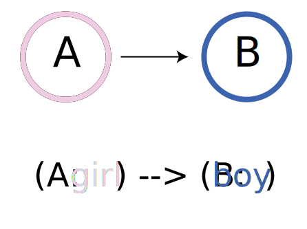
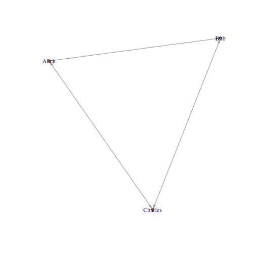

<style>
.sessionInfo code{
  font-size: 60%;
   }

pre {
 white-space: pre-wrap;       /* css-3 */
 white-space: -moz-pre-wrap;  /* Mozilla, since 1999 */
 white-space: -pre-wrap;      /* Opera 4-6 */
 white-space: -o-pre-wrap;    /* Opera 7 */
 word-wrap: break-word;       /* Internet Explorer 5.5+ */
 text-align: left
}

article div h3{
 text-align: left
}

.title-slide {
    background-color: #FFF
}

img {
  max-height: 560px;
  max-width: 964px;
}
</style>

## Background

* Neo4j is a noSQL database which models its data as a graph
* latest version is 2.3.1

---
## Outline

1. Using RNeo4j to connect with a hosted graphDB via Neo4j's REST API
2. Executing cypher queries
3. Using `IGRAPH` to plot and visualise data locally.
4. Using `SHINY` and a `HTMLTOOLS` package `SIGMA` to interactively visualise graph data in a dashboard

--- &twocol

## What is a graph


*** =left

 

*** =right

* __Lines__ are edges
* __Circles__ are nodes / vertices

---

## Why NEO4J - Pattern Search


--- &twocol

## Why use NEO4J

* Pattern Search

*** =left

*** =right


--- &twocol

## Why NEO4J?

### CYPHER allows for path based queries

*** =left


*** =right

* CYPHER allows for an ASCII representation of a path

--- &twocol

## NODE LABELS

*** =left



*** =right

* Finds nodes which of a certain type
* Find paths constructed by these nodes

--- &twocol

## CYPHER: EDGE LABELS

*** =left


*** =right

* Finds nodes which of a certain type
* Find patterns made up of these nodes

```cypher
MATCH
    (A:girl) -[:likes]-> (B:boy)
RETURN
    A, B
```

--- &twocol

## CYPHER: Path

*** =left


*** =right

* Finds nodes which of a certain type
* Find patterns made up of these nodes

```cypher
MATCH
    (A: girl {name: 'ally'})-[:likes]->(B: boy)
RETURN
    B
```

---

## Using R with Neo4j


```r
library(RNeo4j)
```


## 1. Connect with Neo4j


```r
graph <- startGraph("http://metamaps.scelse.nus.edu.sg:7474/db/data/",
            user = cred$user,
            pass = cred$pass)
```

### Security

Set the following if you wish to DISABLE user password login:
`dbms.security.auth_enabled=false` to in `conf/neo4j-server.properties`.


---

## Cypher Functions 101

### Finding a node

```cypher
MATCH (label: {property: })
```


--- &twocol

## 2. Sending A query

*** =left

### Cypher Query

```cypher
MATCH
    (koi:ko {ko:'ko:K00531'})
RETURN
    koi
```

* Search for a node, `koi` 
    * with label `ko`, 
        * property `ko` of value `ko:K00531`

*** =right

### R code


```r
nodeOfInterest <-
graph %>% getNodes(
    query = "MATCH  (koi:ko {ko:'ko:K00531'})
             RETURN koi"
    )
```

Node returned by the query is saved as a variable in R.

--- &twocol

## 2a. Cypher Query  - Returning as NODE "object"

*** =left
### Node Attributes

<li>names</li><li>self</li><li>property</li><li>properties</li><li>labels</li><li>create_relationship</li><li>incoming_relationships</li><li>outgoing_relationships</li><li>class</li><li>username</li><li>password</li>

* **Self** stores the ID, thats how the functions deal with this node

*** =right

### Node Data


```
## List of 5
##  $ : chr "nitrogenase delta subunit [EC:1.18.6.1]"
##  $ : chr "path:ko00625|path:ko00910|path:ko01100|path:ko01120"
##  $ : chr "Chloroalkane and chloroalkene degradation|Nitrogen metabolism|Metabolic pathways|Microbial metabolism in diverse environments"
##  $ : chr "anfG"
##  $ : chr "ko:K00531"
```

---

## 2b. Cypher Query - Returning as data.frame

If you know the property you're interested in, you could plan the query to return it as a data.frame


```r
df = graph %>%
cypher(
"MATCH
    (koi:ko {ko:'ko:K00531'})
RETURN
    koi.ko,
    koi.definition,
    koi.name
    ")
```


```
##      koi.ko                          koi.definition koi.name
## 1 ko:K00531 nitrogenase delta subunit [EC:1.18.6.1]     anfG
```

---

## Creating a node


```r
graph2 = startGraph("http://localhost:7474/db/data/")
bob = graph2 %>%
        createNode("Person", 
                   name = "Bob", 
                   age = 24, 
                   kids = c("Jenny", "Larry"))
#attributes(bob)$self
```
<div class="centered">

</div>

---

## Edge creation


```r
alice   = createNode(graph2, "Person", name = "Alice")
#attributes(alice)$self
charles = createNode(graph2, "Person", name = "Charles")
#attributes(charles)$self

createRel(alice, "WORKS_WITH", bob)
createRel(bob, "KNOWS", charles, since = 2000, through = "Work")
createRel(alice, "KNOWS", charles, list(since = 2001, through = "School"))
```

--- &twocol

*** =left

## Visualising in Igraph

Using cypher get the subgraph which you're interested in and return as an edge list.


```r
edgelist = graph %>% cypher(
"
UNWIND
    {names} AS namelist
MATCH
    (p:Person {name:namelist}) -- (connection:Person)
RETURN
    p.name,
    connection.name
", list(names = c("Alice", "Bob", "Charles"))
)
```

```
## Error in UseMethod("cypher"): no applicable method for 'cypher' applied to an object of class "function"
```

```r
edgelist %<>% setNames(c("from", "to"))
edgelist
```

```
##       from      to
## 1    Alice Charles
## 2    Alice Charles
## 3    Alice Charles
## 4    Alice Charles
## 5    Alice Charles
## 6    Alice Charles
## 7  Charles   Alice
## 8  Charles   Alice
## 9  Charles   Alice
## 10 Charles   Alice
## 11 Charles   Alice
## 12 Charles   Alice
```

*** =left

Convert to igraph object and plot


```r
g = graph_from_data_frame(edgelist)
plot(g, vertex.size=3, edge.arrow.size=0.5)
```

 
--- &twocol

## Common Network analyses

*** =left


*** =right

### Extraction

* subgraphs
* order
* cliches

--- &twocol

## Common Network analyses

*** =left


*** =right

### Algorithms


* shortest path
* Lowest Common Ancestor
* Centrality
* Betweeness

--- &twocol


---

## Metabolic graph

---

## Example Query

```cypher
UNWIND
    { kos } AS koss
OPTIONAL MATCH
    (ako:ko {ko: koss.ko})<--(cpd:cpd)
RETURN 
    cpd.cpd        AS child,
    ako.ko         AS parent,
    ako.definition AS parentName,
    ako.name       AS parentSym,
    cpd.name       AS childName,
    cpd.name       AS childSym
```

--- .sessionInfo


```
## R version 3.1.1 (2014-07-10)
## Platform: x86_64-apple-darwin13.1.0 (64-bit)
## 
## locale:
## [1] en_US.UTF-8/en_US.UTF-8/en_US.UTF-8/C/en_US.UTF-8/en_US.UTF-8
## 
## attached base packages:
## [1] stats     graphics  grDevices utils     datasets  methods   base     
## 
## other attached packages:
##  [1] XML_3.98-1.3           shiny_0.12.2           magrittr_1.5          
##  [4] dplyr_0.4.1            MetamapsDB_0.0.2       slidifyLibraries_0.3.1
##  [7] slidify_0.4.5          igraph_1.0.1           visNetwork_0.1.0      
## [10] digest_0.6.8           RNeo4j_1.6.1           setwidth_1.0-4        
## [13] colorout_1.0-3        
## 
## loaded via a namespace (and not attached):
##  [1] assertthat_0.1    codetools_0.2-14  curl_0.9.3       
##  [4] DBI_0.3.1         devtools_1.9.0    evaluate_0.7.2   
##  [7] formatR_1.2       htmltools_0.2.6   htmlwidgets_0.5.1
## [10] httpuv_1.3.3      httr_1.0.0        jsonlite_0.9.16  
## [13] knitr_1.10.5      markdown_0.7.7    memoise_0.2.1    
## [16] mime_0.3          parallel_3.1.1    R6_2.1.1         
## [19] Rcpp_0.12.0       rjson_0.2.15      RJSONIO_1.3-0    
## [22] rstudioapi_0.3.1  sigma_1.0         stringi_0.5-5    
## [25] stringr_1.0.0     tools_3.1.1       whisker_0.3-2    
## [28] xtable_1.7-4      yaml_2.1.13
```
