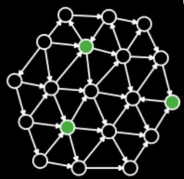
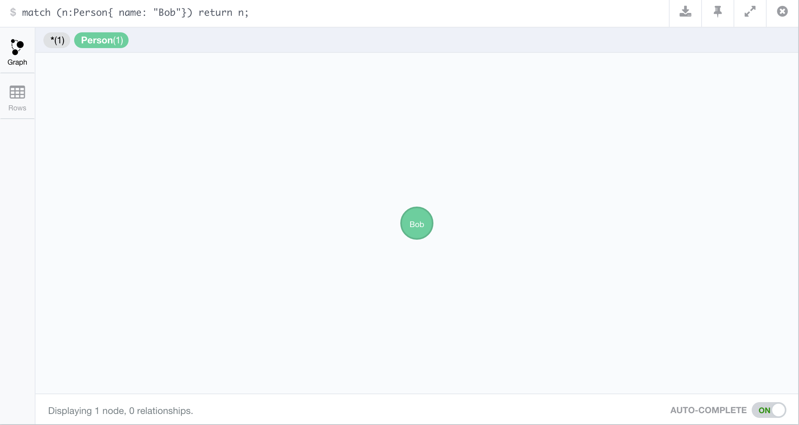

<style>
.sessionInfo code{
  font-size: 60%;
}
/* code to wrap properly */
pre {
 white-space: pre-wrap;       /* css-3 */
 white-space: -moz-pre-wrap;  /* Mozilla, since 1999 */
 white-space: -pre-wrap;      /* Opera 4-6 */
 white-space: -o-pre-wrap;    /* Opera 7 */
 word-wrap: break-word;       /* Internet Explorer 5.5+ */
 text-align: left
}

article div h3{
 text-align: left
}

.title-slide {
    background-color: #FFF
}

img {
  max-height: 560px;
  max-width: 964px;
}
</style>

## Background

* Neo4j is a noSQL database which models its data as a graph
* latest version is 2.3.2

---
## Outline

1. Using RNeo4j to connect with a hosted graphDB via Neo4j's REST API
2. Executing cypher queries
3. Using `IGRAPH` to plot and visualise data locally.
4. Using `SHINY` and a `HTMLTOOLS` package `SIGMA` to interactively visualise graph data in a dashboard

--- &twocol

## What is a graph


*** =left

 

*** =right

* __Lines__ are edges
* __Circles__ are nodes / vertices

---

## Why NEO4J - Pattern Search


--- &twocol

## Why use NEO4J

* Pattern Search

*** =left

*** =right


--- &twocol

## Why NEO4J?

### CYPHER allows for path based queries

*** =left


*** =right

* CYPHER allows for an ASCII representation of a path

--- &twocol

## NODE LABELS

*** =left


*** =right

* Finds nodes which of a certain type
* Find paths constructed by these nodes

--- &twocol

## CYPHER: EDGE LABELS

*** =left


*** =right

* Finds nodes which of a certain type
* Find patterns made up of these nodes

```cypher
MATCH
    (A:girl) -[:likes]-> (B:boy)
RETURN
    A, B
```

--- &twocol

## CYPHER: Path

*** =left


*** =right

* Finds nodes which of a certain type
* Find patterns made up of these nodes

```cypher
MATCH
    (A: girl {name: 'ally'})-[:likes]->(B: boy)
RETURN
    B
```

---

## Using R with Neo4j


```r
library(RNeo4j)
```

## 1. Connect with Neo4j


```r
graph2 = startGraph("http://localhost:7474/db/data/")
```


### Security

Set the following if you wish to DISABLE user password login:
`dbms.security.auth_enabled=false` to in `conf/neo4j-server.properties`.

---

## Cypher Functions 101

### Important idoms

#### 1. Match

```cypher
MATCH (label: {property: something}) -- (label2: {property: something})
```

#### 2. Collection

```cypher
extract(x IN collection | x.property))
```

```cypher
reduce(s = "", x IN collection | s + x.property))
```

---

## Cypher Functions 101: Example

Following code:

1. Finds the following path: `(aa) --> (bb) --> (cc)` 
2. Sums and returns the value: `prop` belonging to all nodes connected nodes with `label3`

```cypher
MATCH
    (aa:label { prop: "some prop" }) --> (bb:label2) --> (cc:label3)
RETURN
    reduce(sum = 0, property in collect(cc.prop) | sum + property) AS finalSum
```

more can be found [here](http://neo4j.com/docs/2.1/cypher-refcard/)

---

## NODE Creation


```r
bob = graph2 %>%
        createNode("Person", 
                   name = "Bob", 
                   age = 24, 
                   kids = c("Jenny", "Larry"))
#attributes(bob)$self
```
<div class="centered">

</div>

---

## EDGE Creation


```r
alice   = createNode(graph2, "Person", name = "Alice")
#attributes(alice)$self
charles = createNode(graph2, "Person", name = "Charles")
#attributes(charles)$self

createRel(alice, "WORKS_WITH", bob)
createRel(bob, "KNOWS", charles, since = 2000, through = "Work")
createRel(alice, "KNOWS", charles, list(since = 2001, through = "School"))
```

<div class="centered">

</div>


--- &twocol

## 2. Sending A Cypher Query

*** =left

### Retrieve NODE

```cypher
MATCH
    (noi:Person {name:'Bob'})
RETURN
    noi
```

* Search for a node, `noi` 
    * with label `Person`, 
        * property `name` of value `Bob`

*** =right

### R code


```r
nodeOfInterest <- graph2 %>% 
getNodes(
"
MATCH
    (noi:Person {name:'Bob'})
RETURN
    noi")
```

--- &twocol

## 2a. Cypher Query

Node returned by the query can be saved as a variable in R.

*** =left

### Node Attributes

<li>names</li><li>self</li><li>property</li><li>properties</li><li>labels</li><li>create_relationship</li><li>incoming_relationships</li><li>outgoing_relationships</li><li>class</li>

* **Self** stores the ID, thats how the functions deal with this node

*** =right

### Node Data


```
## List of 3
##  $ : chr "Bob"
##  $ : int 24
##  $ : chr [1:2] "Jenny" "Larry"
```

---

## 2b. Cypher Query - Returning as data.frame

If you know the property you're interested in, you could plan the query to return it as a data.frame


```r
df = graph2 %>%
cypher(
"MATCH 
    (bob:Person {name:'Bob'})
RETURN
    bob.name, 
    bob.age
")
```


```
##   bob.name bob.age
## 1      Bob      24
```

--- &twocol .sessionInfo 

## Visualising subgraph in IGRAPH

*** =left

Using cypher get the subgraph which you're interested in and return as an edge list.


```cypher
UNWIND
    {names} AS namelist
MATCH
    (p:Person {name:namelist}) -- (connection:Person)
RETURN
    p.name,
    connection.name
```

*** =right


```r
#Edgelist extraction
edgelist = graph2 %>% cypher(query
, list(names = c("Alice", "Bob", "Charles"))
)
edgelist %<>% setNames(c("from", "to"))
```


```
##    from      to
## 1 Alice     Bob
## 2 Alice Charles
## 3 Alice     Bob
## 4 Alice Charles
## 5 Alice     Bob
## 6 Alice Charles
```

---

## Convert to igraph object and plot


```r
g = graph_from_data_frame(edgelist)
plot(g, vertex.size=3, edge.arrow.size=0.5)
```

 

--- &twocol

## Common Network analyses

*** =left


*** =right

### Extraction

* subgraphs
* components
* cliches

--- &twocol

## Common Network analyses

*** =left


*** =right

### Algorithms


* shortest path
* Lowest Common Ancestor
* Centrality
* Betweeness

--- 

## Case Study: Metabolic graph

* Enzyme -> Compound -> Enzyme


```r
metabgraph <- startGraph("http://metamaps.scelse.nus.edu.sg:7474/db/data/",
            user = cred$user,
            pass = cred$pass)
```

--- 

## Subgraph: 1 order neighbourhood from nodeS of interest


```cypher
UNWIND
    { kos } AS koss
OPTIONAL MATCH
    (ako:ko {ko: koss.ko})<--(cpd:cpd)
RETURN 
    cpd.cpd        AS child,
    ako.ko         AS parent,
    ako.definition AS parentName,
    ako.name       AS parentSym,
    cpd.name       AS childName,
    cpd.name       AS childSym
```

--- .sessionInfo

## Subgraph: 1 order neighbourhood from nodeS of interest


```r
nitrogenMetabolism = metabgraph %>% 
cypher(query,list(kos = koi))
```

```
child    parent                               parentName  parentSym       childName        childSym
1: cpd:C00011 ko:K18246        carbonic anhydrase 4 [EC:4.2.1.1]        CA4            CO2;            CO2;
2: cpd:C00011 ko:K18245        carbonic anhydrase 2 [EC:4.2.1.1]        CA2            CO2;            CO2;
```

Make data.frames:
Vertices and Edgelist


```r
nodes = rbind(
    setNames(unique(select(nitrogenMetabolism, parent, parentName)), c("id", "name")), 
    setNames(unique(select(nitrogenMetabolism, child, childName)), c("id", "name"))
)
nitroMetab = graph_from_data_frame(nitrogenMetabolism[,1:2], T, nodes)
```

---

## Extraction: Subgraph


```r
plot(nitroMetab)
```

 

---

## Cliches - weakly connected components


```r
V(nitrogenMetab)$color = nitroMetab %>%
    components("weak")           %$%
    membership                   %>%
    unname                       %>%
    as.factor
plot(nitrogenMetab, vertex.label="")
```

 

---

## Algorithms: Shortest path


```r
noi = c("Formate", "HCO3")                      %>%
lapply(function(x){
   which(grepl(x, V(nitrogenMetab)$Definition))
})
shortpath = nitrogenMetab                       %>%
shortest_paths(noi[[1]], noi[[2]], mode="all")  %$%
vpath[[1]]                                      %>%
as.integer
```


```r
mapply(function(one, two){
    E(nitrogenMetab)[one %--% two]$color <<- "red"
    E(nitrogenMetab)[one %--% two]$width <<- 5
},
one = shortpath %>% head(n=-1),
two = shortpath %>% tail(n=-1),
SIMPLIFY = FALSE
) %>% invisible
```

---

## Algorithms: Shortest path


```r
plot(nitrogenMetab, vertex.label="")
```

 

---


## DEMO - Interactive PLOT


```r
#Requires two libraries.
devtools::install_github("etheleon/sigma") #Modified version of the original sigma0
devtools::install_github("etheleon/metamaps")
```


--- .sessionInfo

## Session Information


```
## R version 3.1.1 (2014-07-10)
## Platform: x86_64-apple-darwin13.1.0 (64-bit)
## 
## locale:
## [1] en_US.UTF-8/en_US.UTF-8/en_US.UTF-8/C/en_US.UTF-8/en_US.UTF-8
## 
## attached base packages:
## [1] stats     graphics  grDevices utils     datasets  methods   base     
## 
## other attached packages:
##  [1] XML_3.98-1.3           shiny_0.12.2           magrittr_1.5          
##  [4] dplyr_0.4.1            MetamapsDB_0.0.2       igraph_1.0.1          
##  [7] visNetwork_0.1.0       digest_0.6.8           RNeo4j_1.6.1          
## [10] slidifyLibraries_0.3.1 slidify_0.4.5          setwidth_1.0-4        
## [13] colorout_1.0-3        
## 
## loaded via a namespace (and not attached):
##  [1] assertthat_0.1    codetools_0.2-14  curl_0.9.3       
##  [4] DBI_0.3.1         evaluate_0.7.2    formatR_1.2      
##  [7] htmltools_0.2.6   htmlwidgets_0.5.1 httpuv_1.3.3     
## [10] httr_1.0.0        jsonlite_0.9.16   knitr_1.10.5     
## [13] markdown_0.7.7    mime_0.3          parallel_3.1.1   
## [16] R6_2.1.1          Rcpp_0.12.0       rjson_0.2.15     
## [19] RJSONIO_1.3-0     sigma_1.0         stringi_0.5-5    
## [22] stringr_1.0.0     tools_3.1.1       whisker_0.3-2    
## [25] xtable_1.7-4      yaml_2.1.13
```
